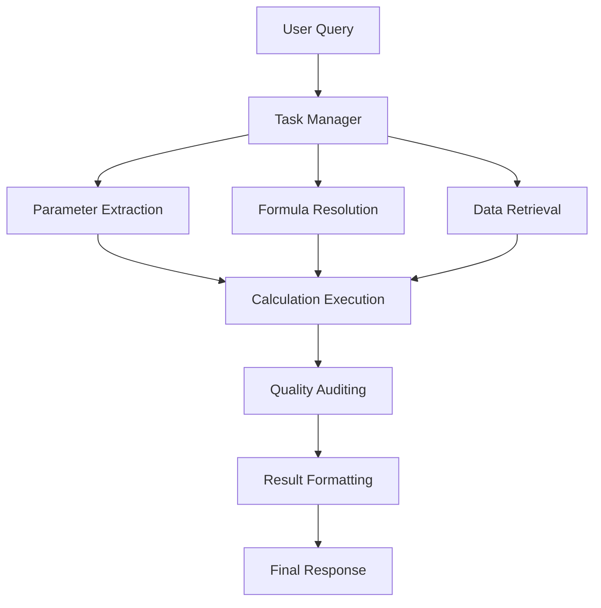

# Agentic System

Welcome to the Agentic System documentation – your comprehensive guide to our multi-agent framework for energy sector analysis, calculations, and reporting.

## Overview

The Agentic System is a powerful framework built with AutoGen and modern AI techniques to solve complex problems in the energy sector. It orchestrates multiple specialized agents to handle tasks including:

- Energy calculations (LCOE, capacity factors, NPV)
- Data retrieval and processing
- Formula resolution and validation
- Quality control and reporting

## Key Features

- **Multi-Agent Architecture**: Specialized agents working together to solve complex problems
- **Flexible Data Integration**: Connect to databases, APIs, and local files
- **Quality Assurance**: Built-in validation and auditing of results
- **Extensible Framework**: Easy to customize and add new capabilities

## Getting Started

New to Agentic System? Start here:

- [Introduction](getting-started/introduction.md) - Learn about the system's architecture and capabilities
- [Installation](getting-started/installation.md) - Set up your environment
- [Quickstart](getting-started/quickstart.md) - Run your first analysis in 15 minutes

## Documentation Sections

- **Getting Started**: Onboarding guides for new users
- **Configuration**: Detailed configuration options
- **Troubleshooting**: Solutions for common issues

## System Architecture

## License

This project is licensed under the MIT License - see the LICENSE file for details.
